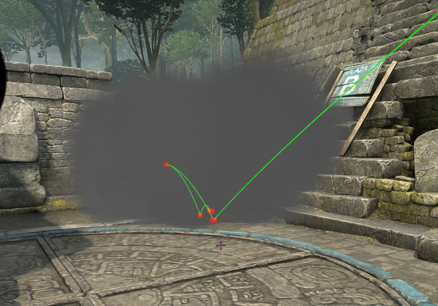
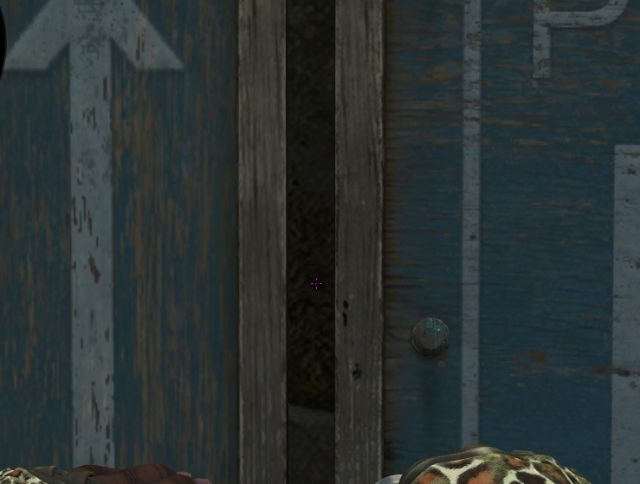
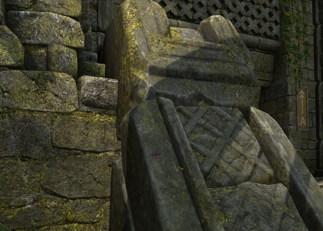

#### Long B smoke from ruins

| Ticks  | Throw type |
| ------ | ---------- |
| 64/128 | Jump       |

| Aim| Pos |
|----|-----|
|  |  |

#### Short B smoke from ruins

| Ticks  | Throw type |
| ------ | ---------- |
| 64/128 | Jump       |

| Aim| Pos |
|----|-----|
|  | |

#### Cave smoke from ruins

| Ticks  | Throw type |
| ------ | ---------- |
| 64/128 | Jump       |

| Aim| Pos |
|----|-----|
|  | | 

### Ancient mid smoke from t spawn

| Ticks  | Throw type |
| ------ | ---------- |
| 64/128 | Jump       |

| Aim| Pos |
|----|-----|
|  |  |

### Ancient donut smoke from stairs

| Ticks  | Throw type |
| ------ | ---------- |
| 64/128 | Jump       |

| Aim| Pos |
|----|-----|
|  |  |

### Ancient CT smoke from stairs

| Ticks  | Throw type |
| ------ | ---------- |
| 64     | Jump       |

| Aim| Pos |
|----|-----|
|  |  |