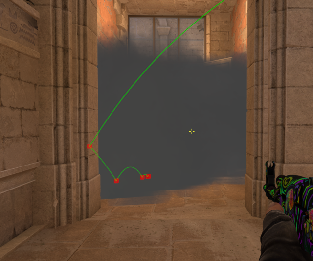
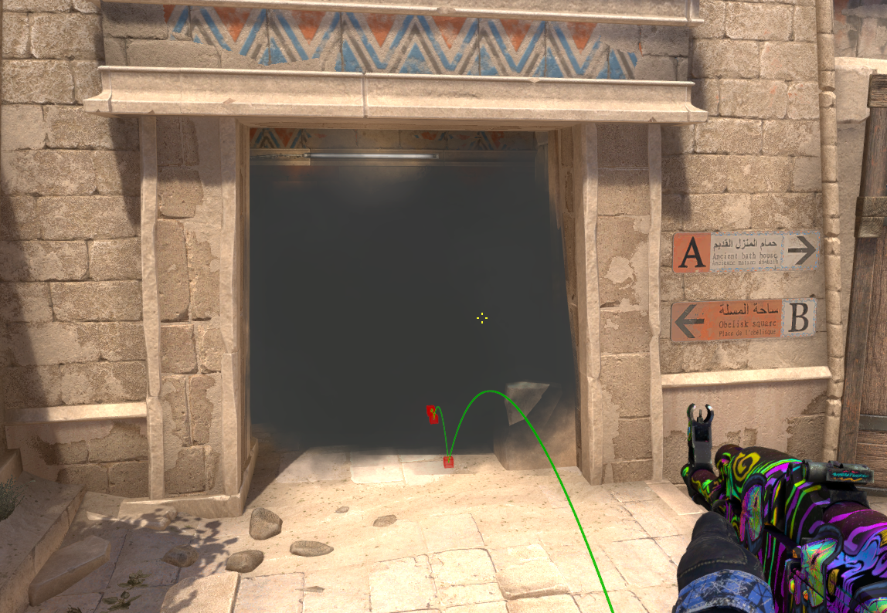
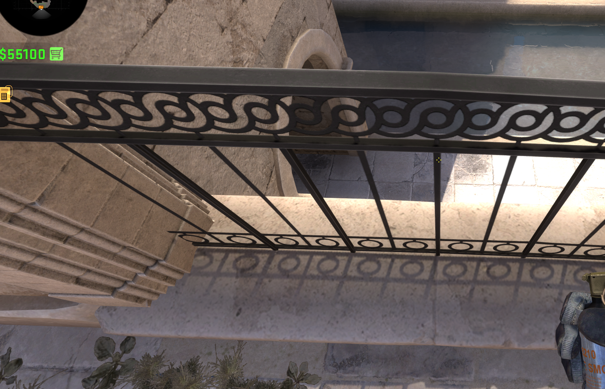
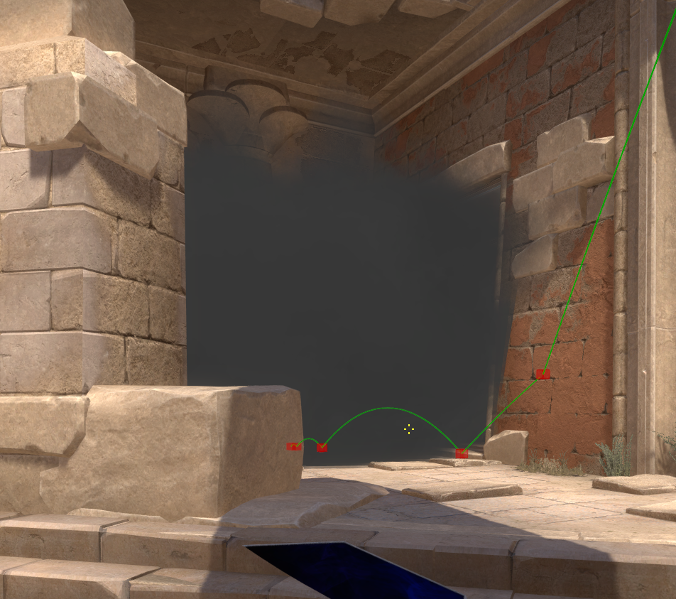
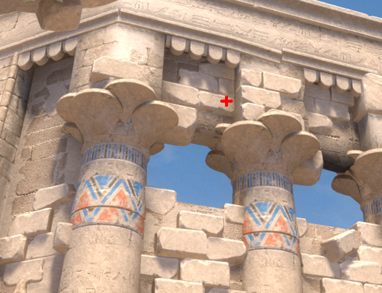
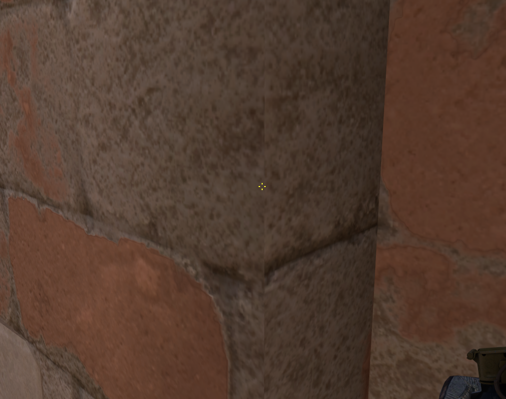

#### A Connector from water

| Ticks  | Throw type |
| ------ | ---------- |
| 64     | Normal     |

| Aim | Pos | 
|----|-----| 
|  |  | 

#### Connector outside smoke from street

| Ticks  | Throw type |
| ------ | ---------- |
| 64     | Jump       |

| Aim | Pos | 
|----|-----| 
|  |  | 

#### Mid house smoke from T spawn

| Ticks  | Throw type |
| ------ | ---------- |
| 64     | Normal     |

| Aim | Pos | 
|----|-----| 
|  |  | 

#### Palace smoke from B outside

| Ticks  | Throw type |
| ------ | ---------- |
| 64     | Normal     |

| Aim | Pos | 
|----|-----| 
|  |  | 

#### Connector inside smoke from B outside

| Ticks  | Throw type |
| ------ | ---------- |
| 64     | Jump       |

| Aim | Pos | 
|----|-----| 
|  |  | 

#### CT long smoke from B outside

| Ticks  | Throw type |
| ------ | ---------- |
| 64     | Normal     |

| Aim | Pos | 
|----|-----| 
|  |  | 