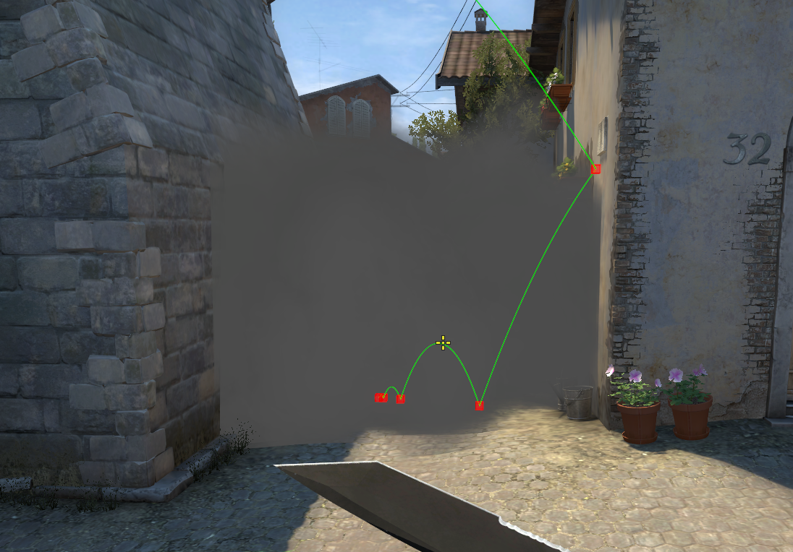
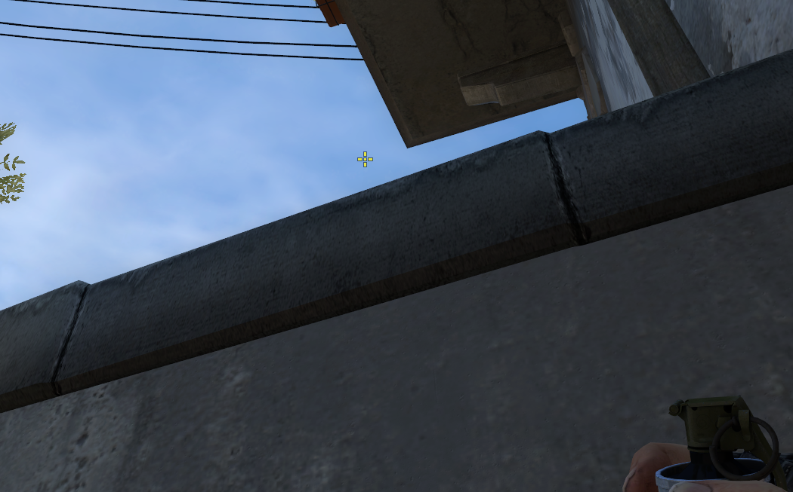
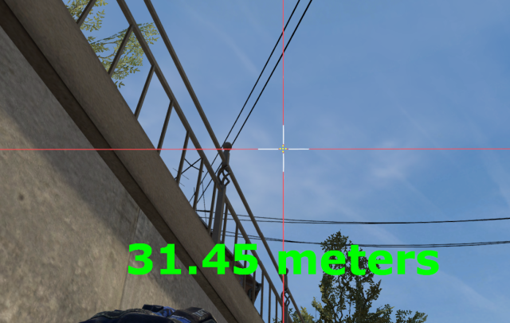
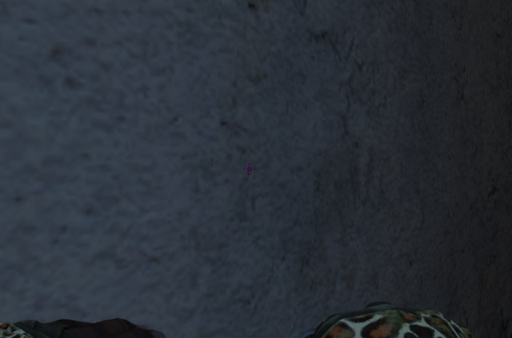
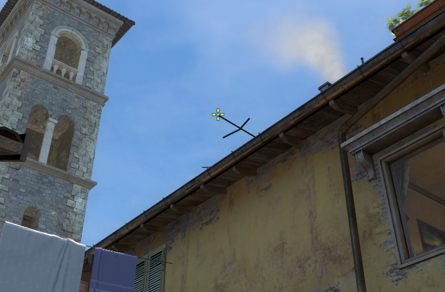
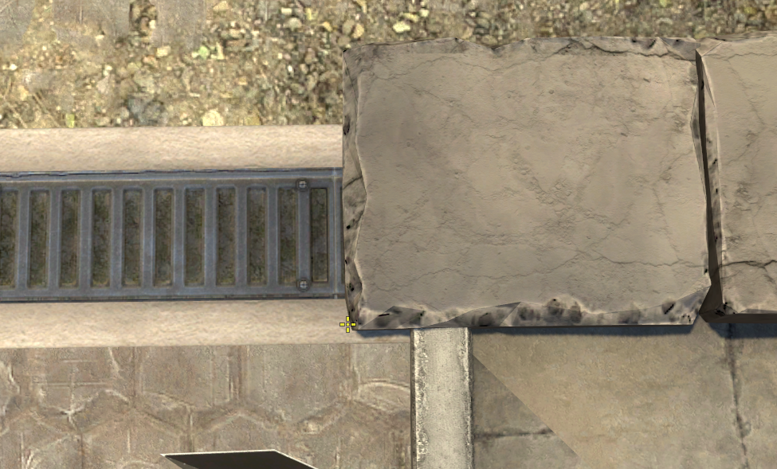
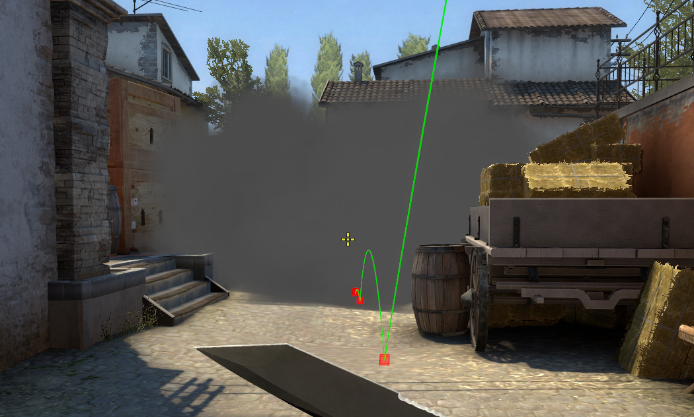
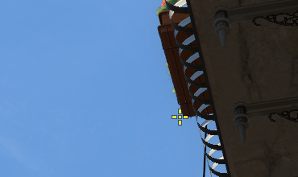
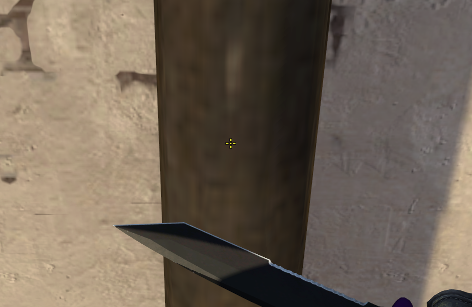

#### CT smoke from banana

| Ticks  | Throw type |
| ------ | ---------- |
| 64     | Normal     |

| Aim | Pos | 
|----|-----| 
|  |  | 

#### Coffin smoke from banana

| Ticks  | Throw type |
| ------ | ---------- |
| 64     | Normal     |

| Aim | Pos | 
|----|-----| 
|  |   | 

#### Short smoke from second mid

| Ticks  | Throw type |
| ------ | ---------- |
| 64/128 | Normal     |

| Aim| Pos |
|----|-----|
|  |  |

#### Short smoke from t-ramp

| Ticks  | Throw type |
| ------ | ---------- |
| 64     | Jump       |

| Aim | Pos | 
|----|-----| 
|  |  | 

#### Deep long smoke from second mid

| Ticks  | Throw type |
| ------ | ---------- |
| 64     | Normal     |

| Aim | Pos | 
|----|-----| 
|  |  | 

#### Cross pit smoke from second mid

| Ticks  | Throw type |
| ------ | ---------- |
| 64     | Normal     |

| Aim | Pos | 
|----|-----| 
|  |  | 