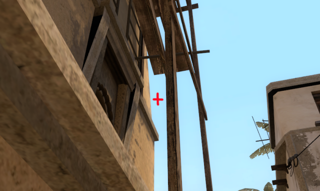

#### Connector smoke from T apps

| Ticks  | Throw type | Description  |
| ------ | ---------- | ------------ |
| 64     | Jump       | Stand in corner, aim lower mid carpet |

| Aim | Pos |
| ---- |-----|
|  |  |

#### Top connector smoke from t mid.

| Ticks  | Throw type | Description |
| ------ | ---------- | ----------- |
| 64     | Normal     | Stand behind boxes, aim below plant |

| Aim| Pos |
|----|-----|
|  | |

#### Stairs smoke from T ramp.

| Ticks  | Throw type | Description |
| ------ | ---------- | ----------- |
| 64     | Normal     | At small hinge. Aim middle of some lines |

| Aim | Pos |
| ---- |-----|
|  |  |

#### CT car platform

| Ticks  | Throw type | Description | 
| ------ | ---------- | ----------- |
| 64     | Normal     | Next to under stairs. Aim in the sky |

| Aim| Pos |
|---|---|
|   |   |

#### Mirage CT mid one way smoke

