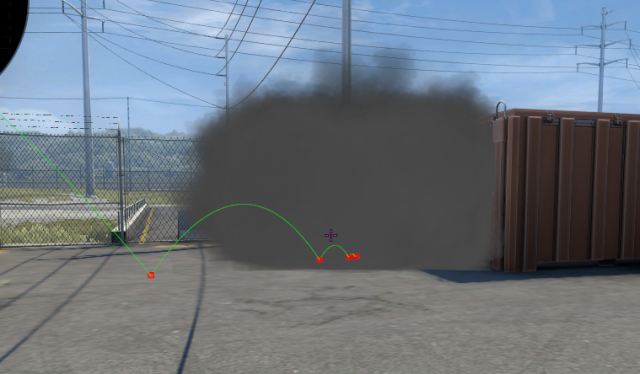
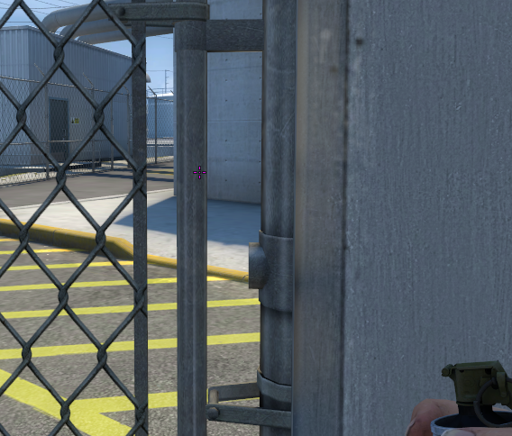
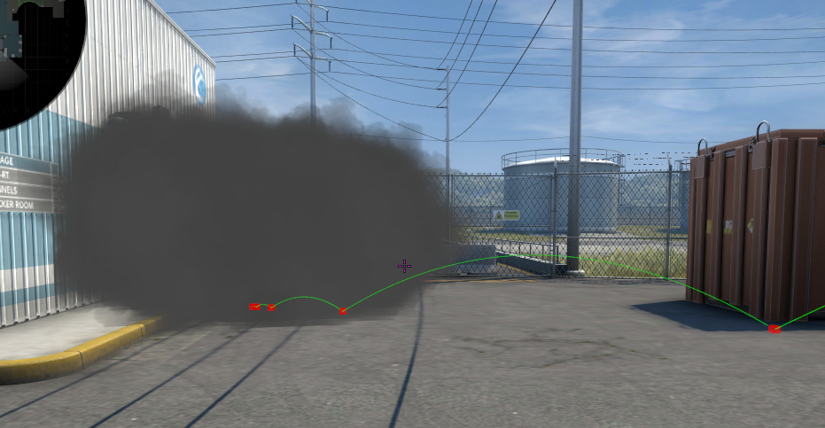
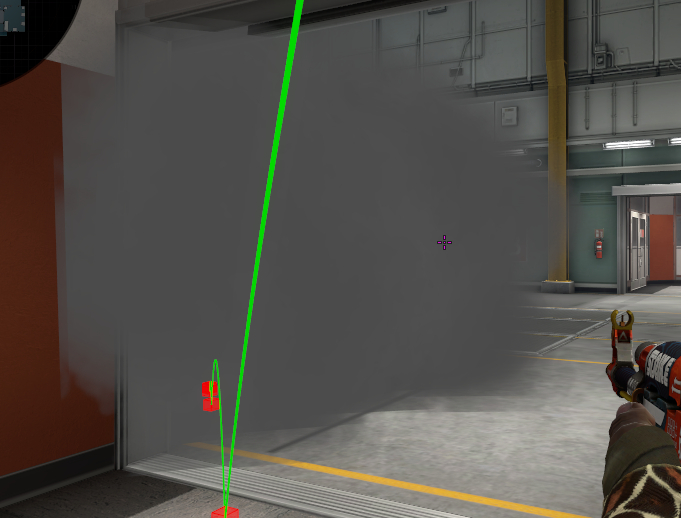
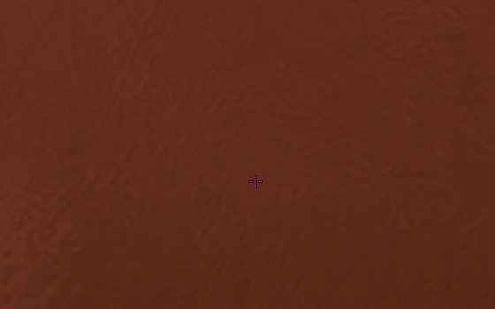

```
Ticks: 64
```

#### Short red smoke yard



| Aim| Pos |
|----|-----|
|  |  |

#### Long red smoke yard

```
Type: Jump throw
```



| Aim| Pos |
|----|-----|
|  |  |

#### Ramp smoke from trophy

```
Type: Running throw (immediately)
```



| Aim| Pos |
|----|-----|
|  |  |